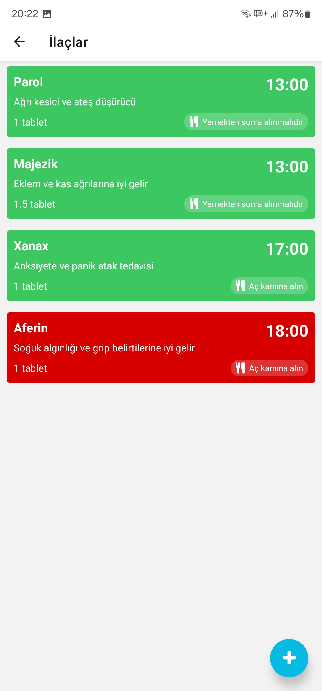
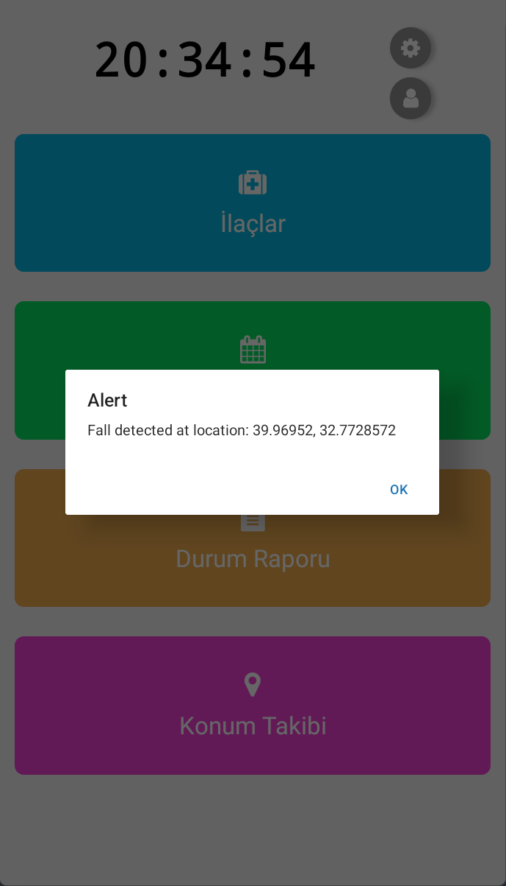

# "Yanındayım" - Senior Companion app:

### A mobile support app for older adults. This app is designed to help seniors or individuals with health conditions by reminding them of their medications and appointments, generating a weekly activity summary, and notifying both them and their family. It includes an emergency button, fall detection, and the ability to make emergency calls and alert family members in the event of a fall. Furthermore, family members or caregivers can track the user’s location, receive updates about them, and provide support even from afar.
### In addition to these features, the app also includes an AI chatbot that users can interact with to receive support and discuss their health status.

### These are just the features we've added within a 20-hour-long hackathon. We plan to continue developing the app and would like to test and launch it. If you have any contributions please feel free to contact us :)

## Technologies:
### Frontend - React Native
### Backtend - Django
### AI chat - Gemini API

# Screenshots

## Login Screenshot

## Register Screenshot

## Home Screenshot

## Profile Screenshot

## Settings Screenshot

## Medicines Screenshot

## Appointments Screenshot

## Chat Screenshot

## Location Tracking Screenshot

## Fall Detected Screenshot

